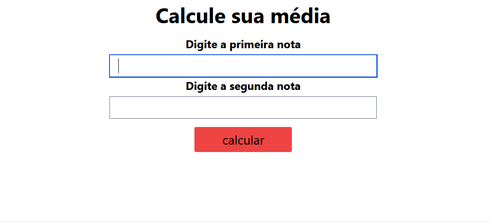

# Student Grade Calculator 🎓

The Student Grade Calculator is a simple application created to calculate a student's average based on their first and second exam scores and provides additional information about the student's performance.

This project utilizes [Tailwind CSS](https://tailwindcss.com/) included via [CDN](https://tailwindcss.com/docs/installation/play-cdn). 

## Features

- **Calculation:** Input the first and second exam scores, and the calculator will display the calculated average.

- **Grade Information:** The application informs whether the student is approved or not, based on a passing threshold (7 in this case).

- **Input Validation:** The application checks for valid inputs, ensuring that the scores are between 0 and 10 and that numeric values are provided.

## Overview

 
